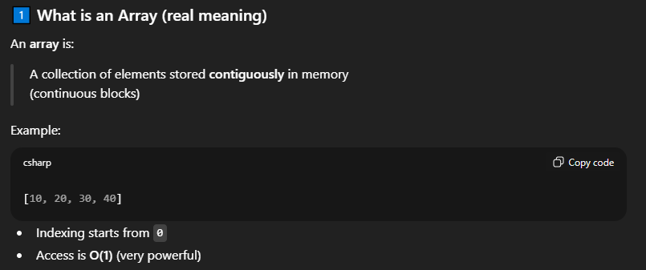

# Arrays

### ARRAYS INTRO

- **WHY ARRAY IS SO POWERFUL? BECAUSE O(1) WHICH IS VERY POWERFUL**
---
### WHY ARRAYS ?

---

### Core Array Operations & Complexity

| Operation              | Time  |
| ---------------------- | ----- |
| Access by index        | O(1)  |
| Traverse               | O(n)  |
| Insert at end          | O(1)* |
| Insert at start/middle | O(n)  |
| Delete                 | O(n)  |

amortized O(1)

