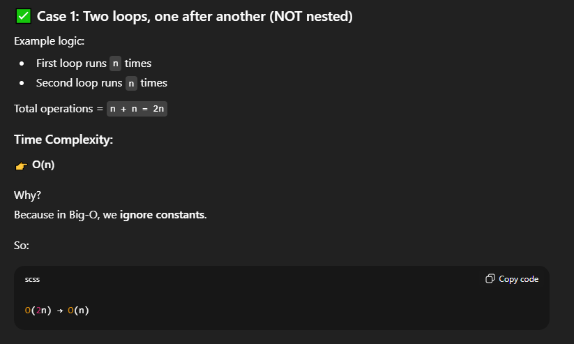
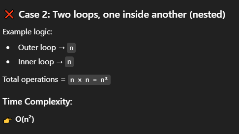
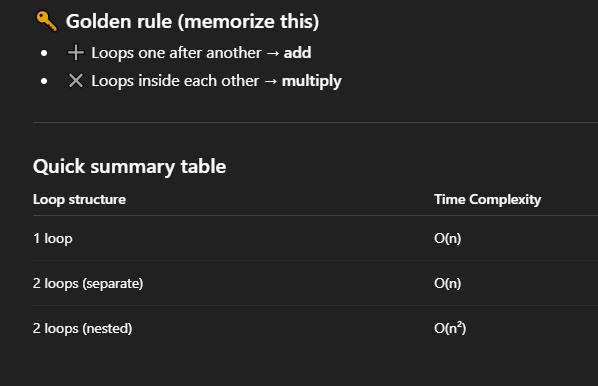

# Time Complexity
- How fast your algorithm grows as input size grows
- **Measured using Big O notation (O(n), O(log n), O(n^2), etc.)**
- Important for understanding efficiency and scalability of algorithms
- Helps in comparing different algorithms for the same problem
- Affects performance, especially with large datasets

---


---


---


# Tiny example

``` python
# O(n)
for i in range(n):
    print(i)

# O(n^2)
for i in range(n):
    for j in range(n):
        print(i, j)

```
- Same language.
- Same syntax.
- Very different performance.

--- 

### QUESTIONS ON TIME COMPLEXITY?
`1Q. If you loop through an array once, what is the time complexity?`

**Ans:** `well the answer is O(n), because here we are going to loop the array once right and let the size of the array is "n" so the answer is O(n).`

---
`2Q. if the array size is same and loops are 2 then (there are 2 individual loops i mean two loops one after the another (not nested loops))?`

**Ans:(HERE AT THIS MOMENT WE DO '+')**


---

`3Q. if the array size is same and when the two loops, one inside the another(nested)?`

**Ans:(HERE AT THIS MOMENT WE DO '*')**



---

### **GOLDEN RULE**



---