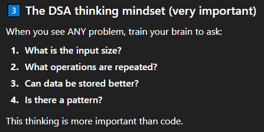

# How to think for every problem

When you see a problem, you can follow these steps to think through it effectively:
1. **Understand the Problem**: Read the problem carefully. Make sure you understand what is being asked. Identify the key components and any constraints.
2. **Break it Down**: Divide the problem into smaller, manageable parts. This makes it easier to tackle each component one at a time.
3. **Research and Gather Information**: Look for any information or resources that can help you understand the problem better. This could include reading articles, watching videos, or consulting experts.
4. **Brainstorm Solutions**: Think of different ways to solve the problem. Don’t limit yourself; write down all possible solutions, even if they seem impractical at first.
5. **Evaluate Options**: Review the solutions you brainstormed. Consider the pros and cons of each option. Think about feasibility, resources required, and potential outcomes.
6. **Choose a Solution**: Select the best solution based on your evaluation. Make sure it addresses the problem effectively and is realistic to implement.
7. **Plan the Implementation**: Create a step-by-step plan to execute the chosen solution. Assign tasks, set deadlines, and gather necessary resources.
8. **Execute the Plan**: Put your plan into action. Follow the steps you outlined and monitor progress.
9. **Review and Reflect**: After implementing the solution, evaluate its effectiveness. Did it solve the problem? What worked well, and what could be improved? Use this reflection to learn for future problem-solving.
By following these steps, you can approach any problem methodically and increase your chances of finding a successful solution.